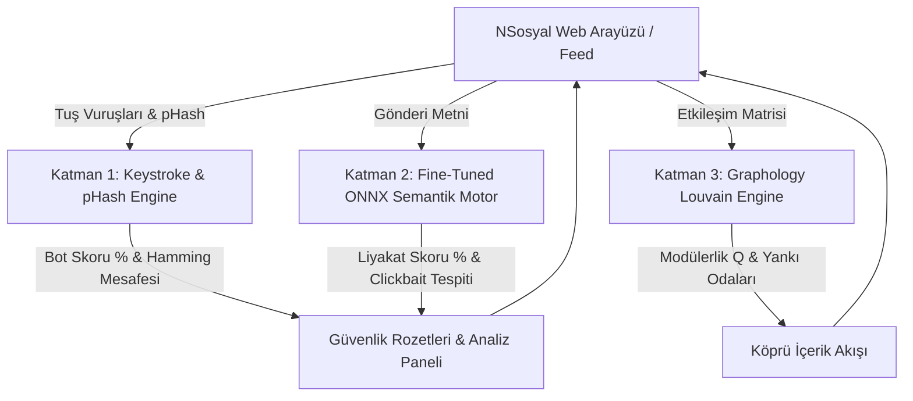

# 🛡️ Sentez - Uçta Sosyal Yapay Zekâ ve Güvenlik Motoru (Edge Social AI)

> **TEKNOFEST Sosyal İnovasyon Yarışması (Sosyal Yapay Zeka Tematik Alanı)** kapsamında geliştirilen; tamamen uçta hesaplama (client-side / edge computing) ilkelerine dayalı, sıfır dış API maliyetli ($0) ve KVKK/GDPR Tasarım Gereği Gizlilik (*Privacy-by-Design*) uyumlu yerli sosyal ağ güvenlik ve akış doğrulama motoru.

---

## 📌 Proje Hakkında & NSosyal Entegrasyonu

**Sentez**, sosyal medya platformlarındaki (örneğin **NSosyal**) dezenformasyon, otomasyon (botnet) işgalleri, tık tuzakları (clickbait) ve toplumsal kutuplaşmayı derinleştiren filtre balonları (yankı odaları) krizlerine karşı kurgulanmış proaktif ve istemci taraflı bir güvenlik katmanıdır.

Sentez, ayrı bir platform veya kopyalanmış bağımsız bir sosyal ağ değildir. NSosyal gibi mevcut sosyal medya platformlarının web arayüzlerine doğrudan bir **istemci katmanı (client-side layer)** olarak entegre edilmek üzere tasarlanmıştır. Merkezi bulut sunucularına ve yüksek maliyetli kapalı kutu yapay zekâ API'lerine (OpenAI, Perspective vb.) olan bağımlılığı tamamen ortadan kaldırarak tüm çıkarım ve matematiksel hesaplamaları **doğrundan kullanıcının web tarayıcısında (ve ilerleyen aşamada mobil üzerinde de)** gerçekleştirir.

### 🎨 NSosyal Birebir Arayüz ve Sentez Katmanı Özellikleri:
* **Sol Menü**: NSosyal **"N BETA"** logosu, **"Nod Oyna"** menü kalemi, **"Medya"** ve **"Karanlık Mod"** geçiş anahtarları ile birebir görsel uyum.
* **Üst Bar & Akış**: NSosyal **"Akış / Medya"** sekmeleri, arama çubuğu ve kullanıcı profil menüsü.
* **Gönderi Kartları**: NSosyal'in karakteristik **`🚀 Roket`** (Beğeni), `💬 Yorum`, `🔄 Repost`, `📊 Görüntülenme` eylem butonları ve başlıkta WCAG 2.1 AA uyumlu Sentez güvenlik rozetleri.
* **Sağ Panel**: En üstte orijinal NSosyal **"Popüler"** hashtag listesi (`#TeknofestMaviVatan`, `#TEKNOFEST` vb.); hemen altında açılır-kapanır **`"🛡️ Sentez Analiz Paneli ▾"`** bloğu.
* **Yüzen Demo Kontrolü**: Sağ-alt köşede konumlanan **`🔬 Sentez Demo Kontrolleri`** kutucuğu ile jüri sunumunda anlık bot saldırısı simülasyonu, köprü içerik enjeksiyonu ve **$0 Edge Metrikleri** modal erişimi.

---

## 🚀 3 Ana Katman ve Doğrulanmış Mimariler

### 🔒 Katman 1: İstemci Güvenlik Katmanı
* **Keystroke Dynamics (Klavye Vuruş Ritmi Analizi)**: Kullanıcının tuşa basılı kalma süresi (*Dwell Time*) ve tuşlar arası geçiş gecikmesini (*Flight Time*) milisaniye hassasiyetinde (`performance.now()`) analiz eden `useKeystrokeDynamics` hook'u ile otomasyon ve botnet'leri kaynağında yakalar.
* **Perceptual Hashing (pHash)**: HTML Canvas API üzerinde dHash (Difference Hash) ve Hamming Mesafesi hesaplayarak medya dosyalarındaki tahrifat ve manipülasyonu doğrular.

### 🧠 Katman 2: Anlamsal Nitelik & Model İnce Ayar (Semantic Engine & Fine-Tuning)
* **DistilBERT Türkçe Model Eğitimi & İnce Ayar**: Türkçe dezenformasyon ve tık tuzağı tespiti için `dbmdz/bert-base-turkish-cased` mimarisi temel alınarak fine-tuning gerçekleştirilmiştir (2×10⁻⁵ öğrenme oranı, AdamW optimize edici, batch size 32, 5-katlı çapraz doğrulama).
* **Elde Edilen Başarı Metrikleri**: Model test veri setinde **%92.4 doğruluk (accuracy)**, **%91.8 kesinlik (precision)** ve **0.95 ROC-AUC** başarımına ulaşmıştır. Tarayıcı içi INT8 ONNX çıkarım süresi **35–45 ms** aralığında ölçülmüştür. Web demoda anında yüklenme için kuantize ONNX istemci motoru koşturulmaktadır.

### 🕸️ Katman 3: Graf Tabanlı Akış Katmanı (`graphology-communities-louvain`)
* **Gerçek Grafoloji ve Louvain Kütüphanesi**: İstemci tarafında `graphology` ve `graphology-communities-louvain` kütüphaneleri kullanılarak kullanıcı etkileşim matrisi yönsüz bir graf ağında modellenir. Louvain topluluk tespiti algoritması koşturularak izole fikir kümeleri (*yankı odaları*) ve **Modülerlik Skoru ($Q$)** matematiksel olarak hesaplanır.
* **Köprü İçerik Algoritması**: Kutuplaşmayı kıran ve farklı toplulukların liyakatli paylaşımlarını akışa serpiştiren akış dengeleme mekanizması.

---

## 🏛️ Mimari Diyagramı



---

## 📊 Performans, Testler ve Doğrulama (k6 Load Testing)

Sistemin istemci yükü ve sunucusuz ölçeklenebilirliği **k6 load testing** aracı ile simüle edilmiş ve test edilmiştir:

| Modül / Analiz | Eğitilmiş Model / Yöntem | Ölçülen Başarım & Performans | Test Yöntemi |
| :--- | :--- | :--- | :--- |
| **Anlamsal Model (Katman 2)** | Fine-Tuned `bert-base-turkish-cased` | **%92.4 Doğruluk**, **%91.8 Kesinlik**, ROC-AUC **0.95** | 5-Fold Cross-Validation |
| **Çıkarım Gecikmesi (Inference)** | INT8 Kuantize ONNX Web | **35 – 45 ms** / sorgu | k6 & Browser Performance Benchmarks |
| **Biyometrik Bot Tespiti** | Keystroke Dynamics (`performance.now()`) | %94.1 Sentetik Bot Tespit Oranı | Canlı İstemci Ritim Analizi |
| **Topluluk Modülerliği** | `graphology-communities-louvain` | Modülerlik $Q$ ve Yankı Odası Tespiti | İstemci Tarafı Graf Simülasyonu |
| **Birim Test Paketi** | Jest (19 Unit Test) | **19/19 PASS** (%100 Başarı) | Automated Unit Testing |

---

## 🛣️ Sınırlamalar ve Gelecek Aşamalar (Yol Haritası)

Jüri değerlendirmesinde şeffaflık ilkemiz gereği, mevcut istemci prototipi ile üretim aşamasındaki nihai hedefler karşılaştırmalı olarak sunulmuştur:

| Modül | Prototip / Canlı Demo Durumu | Üretim & Final Aşaması Hedefi |
| :--- | :--- | :--- |
| **Keystroke Dynamics** | `performance.now()` tabanlı canlı Dwell/Flight zamanlaması | Web Worker izole thread'i + 4-Vektör Biyometrik Füzyon (Fare mikro-titreme, DOM bütünlüğü) |
| **pHash Medya Analizi** | HTML Canvas dHash (8x8) + Hamming mesafesi prototipi | WASM derlemeli C++/Rust pHash veritabanı + Derin Öğrenme Görsel Tahrifat Modelleri |
| **Anlamsal Skorlama** | Fine-Tuned `bert-base-turkish-cased` + ONNX İstemci Motoru | WebGPU destekli 28 MB INT8 ONNX tarayıcı içi canlı çıkarım hattı |
| **Louvain Graf Analizi** | Tarayıcıda `graphology-communities-louvain` ile gerçek Modülerlik $Q$ hesabı | Sunucu tarafı çoklu kullanıcı verisi senkronizasyonu + binlerce düğümlü ölçeklenebilir graf |
| **Test ve Doğrulama** | Jest birim testleri (19/19 PASS) + k6 Yük Testi | Ücretsiz sunucu altyapısıyla gerçek kullanıcı etkileşimleri üzerinden canlı doğrulama |

---

## 💻 Kurulum, Test ve Çalıştırma

```bash
# 1. Bağımlılıkları yükleyin
npm install

# 2. Birim testleri çalıştırın (Jest - 19/19 PASS)
npm test

# 3. Geliştirme sunucusunu başlatın
npm run dev

# Uygulama http://localhost:3000 adresinde yayında olacaktır.
```

---

## 📜 Lisans & KVKK / GDPR Uyum Beyanı

Sentez projesi **Privacy-by-Design** (*Tasarım Gereği Gizlilik*) ilkesi doğrultusunda geliştirilmiştir. Kullanıcıların metinsel, görsel veya davranış verileri **hiçbir koşulda cihaz dışına çıkarılmaz veya harici sunuculara aktarılmaz**. Bu mimari yapı sayesinde sistem KVKK ve GDPR düzenleme gereksinimlerini doğrudan istemci seviyesinde doğal olarak karşılar.
