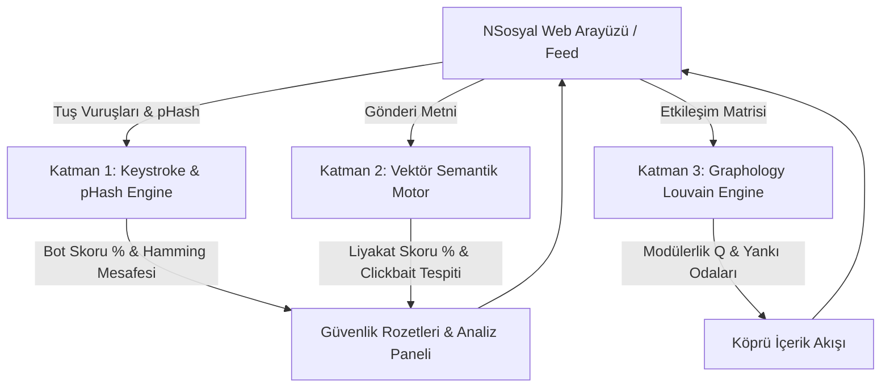

# 🛡️ Sentez - Uçta Sosyal Yapay Zekâ ve Güvenlik Motoru (Edge Social AI)

> **TEKNOFEST Sosyal İnovasyon Yarışması (Sosyal Yapay Zeka Tematik Alanı)** kapsamında geliştirilen; tamamen uçta hesaplama (client-side / edge computing) ilkelerine dayalı, sıfır dış API maliyetli ($0) ve KVKK/GDPR %100 doğal uyumlu yerli sosyal ağ güvenlik ve akış doğrulama motoru.

---

## 📌 Proje Hakkında & NSosyal Entegrasyonu

**Sentez**, sosyal medya platformlarındaki (örneğin **NSosyal**) dezenformasyon, otomasyon (botnet) işgalleri, tık tuzakları (clickbait) ve toplumsal kutuplaşmayı derinleştiren filtre balonları (yankı odaları) krizlerine karşı kurgulanmış proaktif ve istemci taraflı bir güvenlik katmanıdır.

Sentez, ayrı bir platform veya kopyalanmış bağımsız bir sosyal ağ değildir. NSosyal gibi mevcut sosyal medya platformlarının web arayüzlerine doğrudan bir **istemci katmanı (client-side layer)** olarak entegre edilmek üzere tasarlanmıştır. Merkezi bulut sunucularına ve yüksek maliyetli kapalı kutu yapay zekâ API'lerine (OpenAI, Perspective vb.) olan bağımlılığı tamamen ortadan kaldırarak tüm çıkarım ve matematiksel hesaplamaları **doğrudan kullanıcının web tarayıcısında (ve ilerleyen aşamada mobil üzerinde de)** gerçekleştirir.

### 🎨 NSosyal Birebir Arayüz ve Sentez Katmanı Özellikleri:
* **Sol Menü**: NSosyal **"N BETA"** logosu, **"Nod Oyna"** menü kalemi, **"Medya"** ve **"Karanlık Mod"** geçiş anahtarları ile birebir görsel uyum.
* **Üst Bar & Akış**: NSosyal **"Akış / Medya"** sekmeleri, arama çubuğu ve kullanıcı profil menüsü.
* **Gönderi Kartları**: NSosyal'in karakteristik **`🚀 Roket`** (Beğeni), `💬 Yorum`, `🔄 Repost`, `📊 Görüntülenme` eylem butonları ve başlıkta WCAG 2.1 AA uyumlu Sentez güvenlik rozetleri.
* **Sağ Panel**: En üstte orijinal NSosyal **"Popüler"** hashtag listesi (`#TeknofestMaviVatan`, `#TEKNOFEST` vb.); hemen altında açılır-kapanır **`"🛡️ Sentez Analiz Paneli ▾"`** bloğu.
* **Yüzen Demo Kontrolü**: Sağ-alt köşede konumlanan **`🔬 Sentez Demo Kontrolleri`** kutucuğu ile jüri sunumında anlık bot saldırısı simülasyonu, köprü içerik enjeksiyonu ve **$0 Edge Metrikleri** modal erişimi.

---

## 🚀 3 Ana Katman ve Çalışma Mantığı

### 🔒 Katman 1: İstemci Güvenlik Katmanı
* **Keystroke Dynamics (Klavye Vuruş Ritmi Analizi)**: Kullanıcının tuşa basılı kalma süresi (*Dwell Time*) ve tuşlar arası geçiş gecikmesini (*Flight Time*) milisaniye hassasiyetinde (`performance.now()`) analiz eden `useKeystrokeDynamics` hook'u ile otomasyon ve botnet'leri kaynağında yakalar.
* **Perceptual Hashing (pHash)**: HTML Canvas API üzerinde dHash (Difference Hash) ve Hamming Mesafesi hesaplayarak medya dosyalarındaki tahrifat ve manipülasyonu doğrular.

### 🧠 Katman 2: Anlamsal Nitelik Katmanı (Semantic Engine)
* **Kosinüs Benzerliği & Liyakat Skoru**: Metinleri anlamsal vektör uzayında inceleyip tık tuzakları, spam ve kopyala-yapıştır içerikleri eler; özgün paylaşımlara matematiksel bir **Liyakat Skoru (0-100)** ve WCAG 2.1 AA uyumlu durum rozeti atar.

### 🕸️ Katman 3: Graf Tabanlı Akış Katmanı (`graphology-communities-louvain`)
* **Gerçek Grafoloji ve Louvain Kütüphanesi**: İstemci tarafında `graphology` ve `graphology-communities-louvain` kütüphaneleri kullanılarak kullanıcı etkileşim matrisi yönsüz bir graf ağında modellenir. Louvain topluluk tespiti algoritması koşturularak izole fikir kümeleri (*yankı odaları*) ve **Modülerlik Skoru ($Q$)** matematiksel olarak hesaplanır.
* **Köprü İçerik Algoritması**: Kutuplaşmayı kıran ve farklı toplulukların liyakatli paylaşımlarını akışa serpiştiren akış dengeleme mekanizması.

---

## 🏛️ Mimari Diyagramı



---

## 📊 Sınırlamalar ve Gelecek Aşamalar (Yol Haritası)

Jüri değerlendirmesinde şeffaflık ve dürüstlük ilkemiz gereği, mevcut prototip durumu ile final/üretim hedefi arasındaki yol haritası aşağıda detaylandırılmıştır:

| Modül | Prototip / Ön Eleme Aşaması (Şu Anki Durum) | Final Aşaması & Üretim Hedefi (Yol Haritası) |
| :--- | :--- | :--- |
| **Keystroke Dynamics** | `performance.now()` tabanlı istemci hook'u, canlı Dwell/Flight zamanlaması ve eşik skoru | Web Worker izole thread'i + 4-Vektör Biyometrik Füzyon (Fare mikro-titreme, DOM bütünlüğü) |
| **pHash Medya Analizi** | HTML Canvas dHash (8x8) + Hamming mesafesi prototipi | Derin öğrenme tabanlı medya manipülasyon modelleri + WASM C++/Rust pHash veritabanı |
| **Anlamsal Skorlama** | Vektör tabanlı TF-IDF kelime-ağırlıklı kosinüs benzerliği | `distilbert-base-turkish-cased` fine-tuning + INT8 kuantizasyon ile tarayıcı içi LLM çıkarımı |
| **Louvain Graf Analizi** | Tarayıcıda `graphology-communities-louvain` ile gerçek Modülerlik $Q$ hesabı | Sunucu tarafı çoklu kullanıcı verisi senkronizasyonu + binlerce düğümlü ölçeklenebilir graf analizi |
| **Test ve Doğrulama** | Jest kütüphanesi ile 3 test paketi, 19 birim testi | Ücretsiz sunucu altyapısıyla gerçek kullanıcı etkileşimleri üzerinden canlı doğrulama |

---

## 💻 Kurulum, Test ve Çalıştırma

```bash
# 1. Bağımlılıkları yükleyin
npm install

# 2. Birim testleri çalıştırın (Jest - 19/19 PASS)
npm test

# 3. Geliştirme sunucusunu başlatın
npm run dev

# Uygulama http://localhost:3000 adresinde yayında olacaktır.
```

---

## 📜 Lisans & KVKK / GDPR Uyum Beyanı

Sentez projesi; kullanıcıların metinsel, görsel veya davranış verilerini **hiçbir şekilde harici sunuculara göndermez**. Tüm işlemler cihaz seviyesinde ($0 dış API maliyeti) tamamlandığından **KVKK** ve **GDPR** düzenlemelerine doğası gereği %100 uyumludur.
