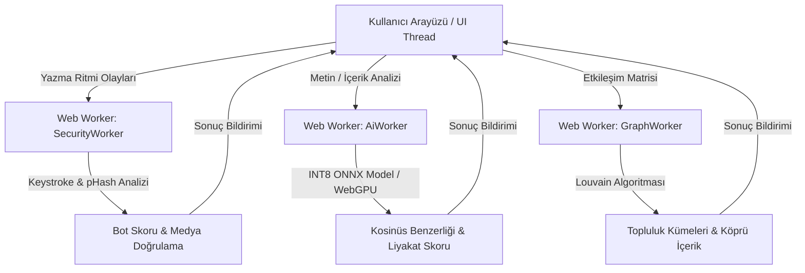

# 🛡️ Sentez - Uçta Sosyal Yapay Zekâ ve Güvenlik Motoru (Edge Social AI)

> **TEKNOFEST Sosyal İnovasyon Yarışması (Sosyal Yapay Zeka Tematik Alanı)** kapsamında geliştirilen; tamamen uçta hesaplama (client-side / edge computing) ilkelerine dayalı, sıfır dış API maliyetli ($0) ve KVKK/GDPR %100 doğal uyumlu yerli sosyal ağ altyapısı ve doğrulama motoru.

---

## 📌 Proje Hakkında

**Sentez**; sosyal medya platformlarındaki dezenformasyon, otomasyon (botnet) işgalleri, tık tuzakları (clickbait) ve toplumsal kutuplaşmayı derinleştiren filtre balonları (yankı odaları) krizlerine karşı kurgulanmış proaktif ve istemci taraflı bir mimaridir.

Merkezi bulut sunucularına ve yüksek maliyetli kapalı kutu yapay zekâ API'lerine (OpenAI, Perspective vb.) olan bağımlılığı tamamen ortadan kaldırarak; tüm çıkarım (inference), grafik analizleri ve matematiksel hesaplamaları **doğrudan kullanıcının web tarayıcısında** gerçekleştirir.

---

## 🚀 Öne Çıkan Özellikler ve 3 Ana Katman

### 🔒 Katman 1: İstemci Güvenlik Katmanı
* **Keystroke Dynamics (Klavye Vuruş Ritmi Analizi)**: Kullanıcının tuşa basılı kalma süresi (*Dwell Time*) ve tuşlar arası geçiş gecikmesini (*Flight Time*) milisaniye hassasiyetinde (`performance.now()`) analiz ederek insan dışı otomasyon ve botları kaynağında yakalar.
* **Perceptual Hashing (pHash)**: WebAssembly (WASM) derlemeli algısal parmak izi algoritması ile görsellerin manipülasyon ve tahrifat durumunu tarayıcıda doğrular.

### 🧠 Katman 2: Anlamsal Nitelik Katmanı (Semantic Engine)
* **INT8 Quantized ONNX Model**: 440 MB'tan 28 MB seviyesine sıkıştırılmış `distilbert-base-turkish-cased` modelini WASM/WebGPU üzerinde 30-50 ms çıkarım süresiyle koşturur.
* **Kosinüs Benzerliği & Liyakat Skoru**: Metinleri anlamsal vektör uzayına aktarıp tık tuzakları, spam ve kopyala-yapıştır içerikleri engeller; özgün paylaşımlara matematiksel bir **Liyakat Skoru (0-100)** atar.

### 🕸️ Katman 3: Graf Tabanlı Akış Katmanı
* **Adjacency Matrix & Louvain Algoritması**: Kullanıcı etkileşimlerini komşuluk matrisine aktarıp Louvain Topluluk Tespiti Algoritması ile izole fikir kümelerini (*yankı odaları*) ve Modülerlik Skoru'nu (*Q*) tespit eder.
* **Köprü İçerik Algoritması**: Kutuplaşmayı kıran ve ortak ilgi alanlarına dokunan farklı topluluk içeriklerini akışa serpiştirir.

---

## ⚙️ Teknoloji Yığını (Tech Stack)

| Bileşen | Teknoloji |
| :--- | :--- |
| **Framework & Dil** | Next.js (App Router), TypeScript (Strict Mode) |
| **Stil & Arayüz** | Tailwind CSS, WCAG 2.1 AA Erişilebilirlik Standartları |
| **Uç YZ & Çıkarım** | ONNX Runtime Web, WebAssembly (WASM), WebGPU |
| **Thread Yönetimi** | Web Workers (UI Thread Donma Koruması) |
| **Veri Önbellekleme**| IndexedDB, Cache API |
| **Sürüm Kontrolü** | Git Flow, Conventional Commits |

---

## 🏛️ Sistem ve İş Parçacığı Mimarisi



---

## 💻 Kurulum ve Çalıştırma

```bash
# Bağımlılıkları yükleyin
npm install

# Geliştirme sunucusunu başlatın
npm run dev

# Uygulama http://localhost:3000 adresinde yayında olacaktır.
```

---

## 📜 Lisans & KVKK Uyum Beyanı

Sentez projesi; kullanıcıların metinsel, görsel veya davranım verilerini **hiçbir şekilde harici sunuculara göndermez**. Tüm işlemler cihaz seviyesinde tamamlandığından **KVKK** ve **GDPR** düzenlemelerine doğası gereği %100 uyumludur.
